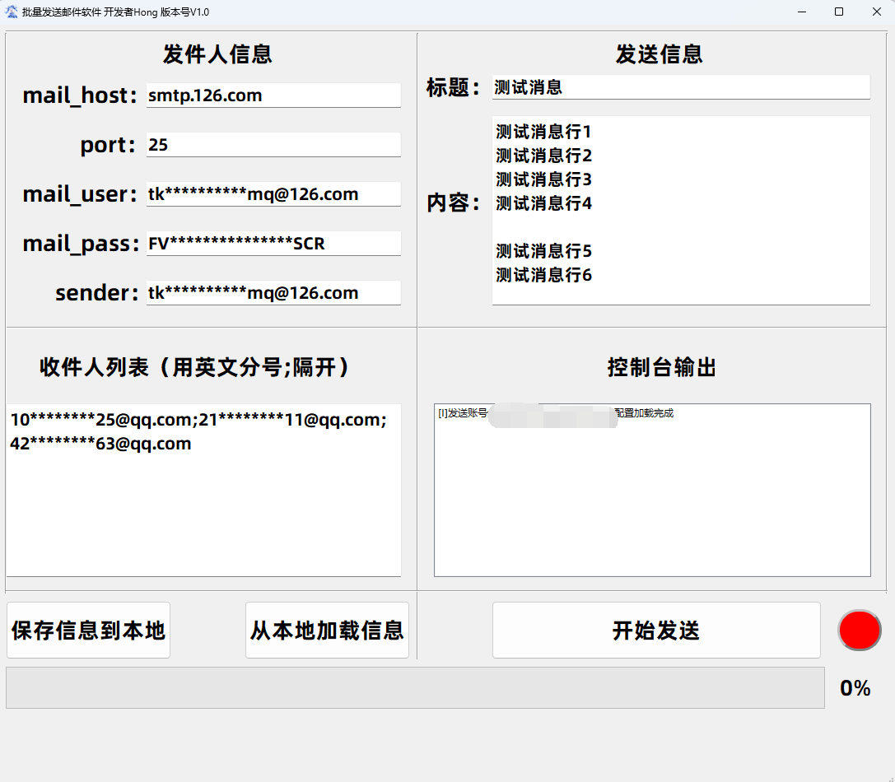
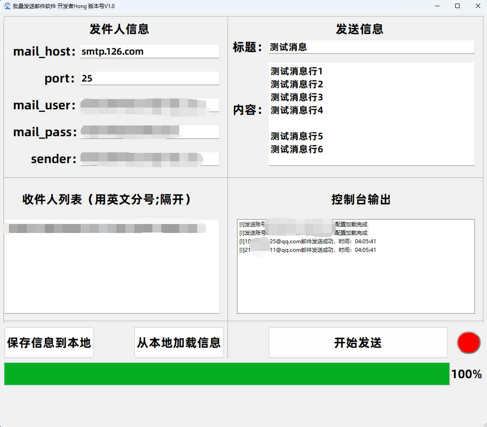
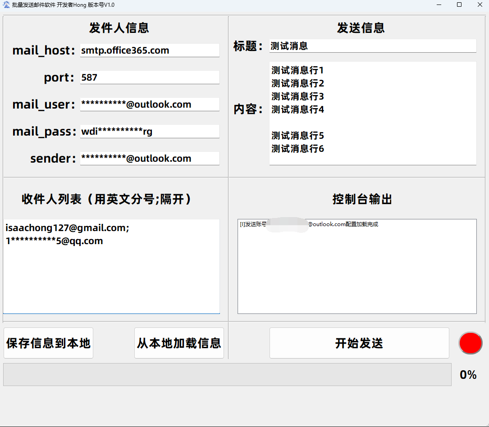
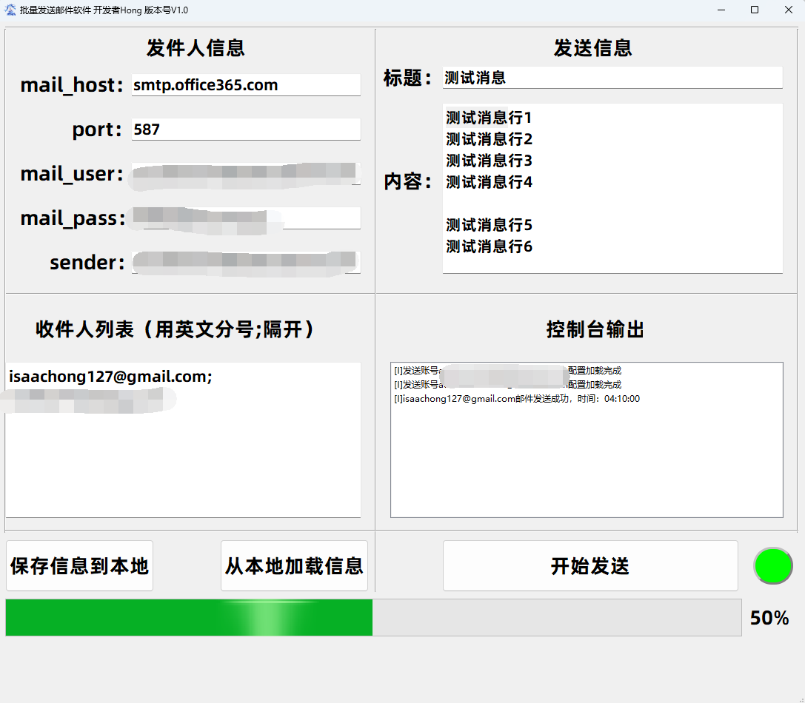
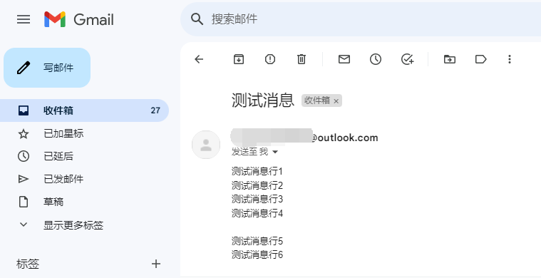
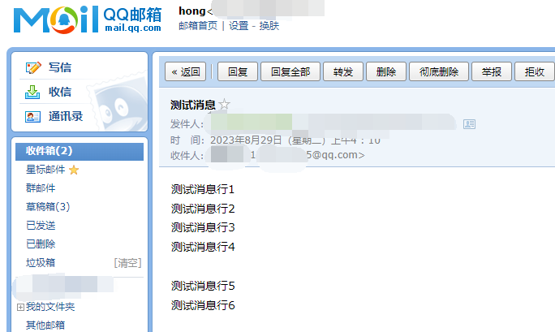

# Bulk-Email-Sender
 Batch sending emails to individual recipients with GUI interface.批量发送单收件人邮件，带有GUI界面。

 给朋友写的小功能，顺带着发上来

 # Update
 V2.0 增加2个新功能，支持发送HTML格式文本，支持添加附件
 
 # Usage
 mail_host：SMTP服务器地址

 port：SMTP服务器端口

 mail_user：用户名

 mail_pass：口令密码

 sender：发件人邮箱

 ## Eg1：@126.com

  
## Eg2：@outlook.com

## 发送完成

